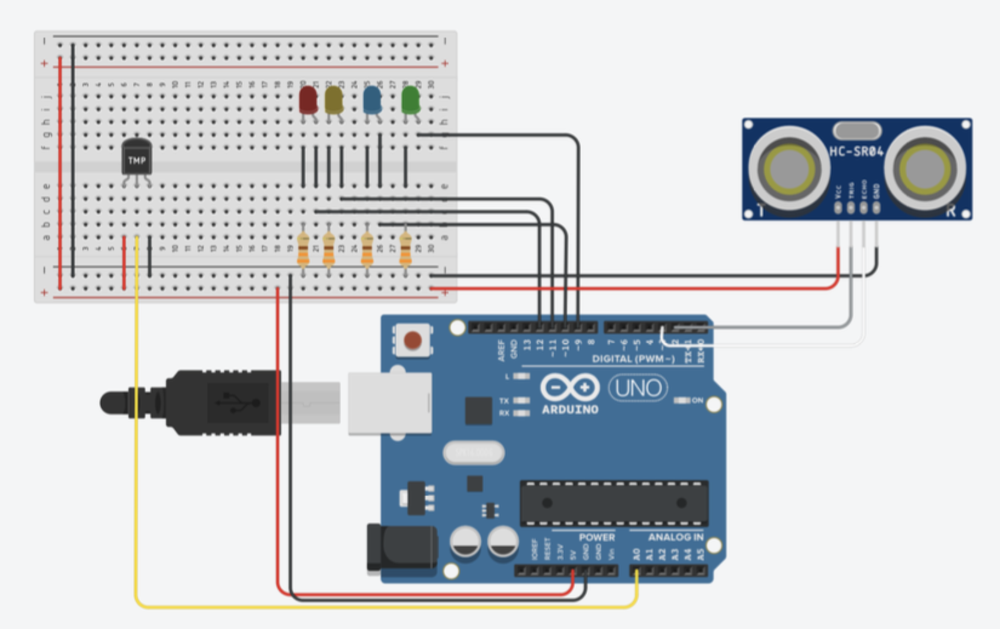

# **Smart Thermal Flask**
> *An intelligent thermos that measures liquid level and temperature in real time.*

## **Introduction**
The "Smart Thermal Flask" project was developed at the Instituto Tecnológico de Estudios Superiores de Monterrey, Campus Guadalajara. It aims to enhance a regular thermos by integrating sensors and programming to provide real-time information on liquid level and temperature, improving user awareness and safety.

## **Project Description**
- **Main functionality:** Measures liquid level and temperature inside a thermos, using LEDs to indicate the current level and whether the liquid is too hot to consume.
- **Technologies used:** Arduino, DHT11 temperature and humidity sensor, ultrasonic sensor, LEDs, Tinkercad for simulation.
- **Challenges faced:** Ensuring reliable sensor readings and LED signaling, managing power efficiency, and maintaining accurate measurements in varied conditions.
- **Future improvements:** Consideration for a display or Bluetooth integration to transmit real-time data to a mobile app.

## **Table of Contents**
1. [Introduction](#introduction)
2. [Project Description](#project-description)
3. [Installation](#installation)
4. [Usage](#usage)
5. [License](#license)

## **Installation**

1. **Prerequisites**:
   - **Arduino IDE** - [Installation guide](https://www.arduino.cc/en/software)
   - **DHT library** - Install the "DHT sensor library" through the Arduino Library Manager.

2. **Clone the repository:**
   ```bash
   git clone https://github.com/ivmg5/Smart-Thermal-Flask.git
   cd Smart-Thermal-Flask
   ```

3. **Upload Code to Arduino**:
   - Open `Code.ino` in the Arduino IDE.
   - Connect your Arduino device.
   - Select the appropriate board and port.
   - Upload the code to your Arduino.

### **Configuration Options**
   - Adjust `DHTTYPE` and `DHTPin` as needed for different sensors.
   - Modify temperature threshold settings within the code to customize when the warning LED activates.

## **Usage**
Follow these steps to operate the Smart Thermal Flask:
1. Set up the hardware components, including the ultrasonic and DHT11 sensors, LEDs, and Arduino board, as shown in the Tinkercad model.
2. Power on the Arduino.
3. Observe the LED indicators:
   - **Level Indicator**: LEDs indicate if the flask is full (distance ≤ 4 cm), half-full (4 cm < distance ≤ 10 cm), or low (distance > 10 cm).
   - **Temperature Warning**: The LED flashes if the temperature exceeds the set limit (e.g., above 27°C).

**Example output**:
```plaintext
Distance = 6 cm
Temperature: 28 °C
```

**Hardware Setup:**



## **License**
This project is licensed under the MIT License.

[](#)
[](#)
